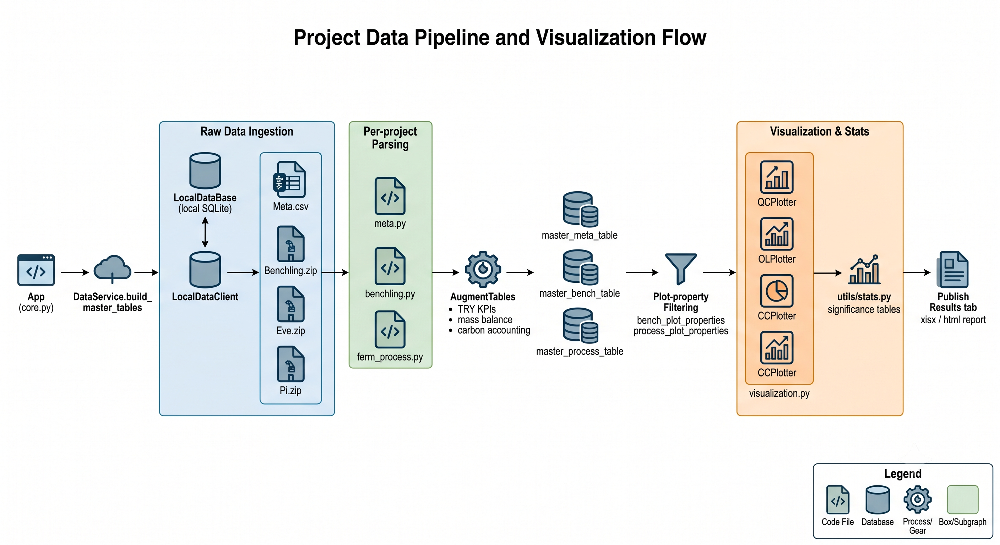

# BioCanvas

A comprehensive GUI for processing, analyzing, and visualizing multi-modality
biological experiment data. BioCanvas runs as an 
[ipywidgets](https://ipywidgets.readthedocs.io/)-based Jupyter notebook
application (`ui.ipynb`), pulling raw experiment files from a local
SQLite-backed store and turning them into consolidated tables, statistics,
and plots — no external services required.

<p align="center">
  
</p>

## Setup & Installation

### 1. Clone the Repository

```bash
git clone https://github.com/paymantohidifar/BioCanvas.git --branch main biocanvas
cd biocanvas
```

Requires **Python 3.11**. Tested and verified on **Linux (64-bit)**; it
should also run on **Windows (64-bit)** and **macOS (Apple Silicon/ARM64)**
without further changes, though those platforms aren't covered by CI.

### 2. Fast Local Installation via `uv`

[uv](https://github.com/astral-sh/uv) is an ultra-fast Python package
installer and resolver.

```bash
# Optional: preview the dependency resolution without installing anything
uv sync --group dev --dry-run

# Create the virtual environment and install runtime + dev dependencies
uv sync --group dev

# Run the test suite to verify the installation
uv run pytest
```

### 3. Local Installation via `pixi` (Isolated Environments)

If you use [Pixi](https://pixi.sh/) for system-level dependency isolation,
packages are managed automatically inside a local, hidden `.pixi/`
directory — no manual virtualenv activation needed.

```bash
# Install the default environment (runtime + dev tools), from pyproject.toml + pixi.lock
pixi install

# Run the test suite via the built-in Pixi task
pixi run test

# Lint and format
pixi run lint
pixi run format
```

### 4. Launch the App

```bash
pixi run jupyter notebook ui.ipynb
# or, inside a uv-managed environment:
uv run jupyter notebook ui.ipynb
```

Select a project, enter its passcode, click **Connect**, then **Process**
to build the master tables and unlock the analysis tabs.

## Project Passcodes

`src/biocanvas/passcodes.json` is intentionally gitignored — it maps each
project name to a PBKDF2-HMAC-SHA256 passcode hash, and plaintext passcodes
must never be committed to source control (see `src/biocanvas/utils/auth.py`).
You need to generate your own before you can **Connect** to a project in the
UI.

**1. Hash a passcode for each project** with `auth.hash_passcode`:

```bash
pixi run python -c "from biocanvas.utils.auth import hash_passcode; print(hash_passcode('your-passcode-here'))"
```

This prints a `salt:hash` string (e.g. `a3f1c2...:9c2b47...`). Run it once
per project you want to unlock (`helix`, `spore`, ...) — never reuse the same
passcode across projects.

**2. Create `src/biocanvas/passcodes.json`**, keyed by project subpackage
name, with the hashes from step 1:

```json
{
  "helix": "a3f1c2...:9c2b47...",
  "spore": "d4e2b1...:7f0a93..."
}
```

These keys populate the UI's project dropdown (`DataService.PROJECT_LIST`);
**Connect** checks the entered passcode against the matching hash via
`auth.verify_passcode` — the plaintext passcode is never stored anywhere.

## Graphical User Interface

BioCanvas is organized into six tabs, each backed by its own widget set and
delegating all data work to a shared `DataService`:

1. **Process Data** — pick a project and experiments, connect to the local
   database, and process raw files into master tables.
2. **QC Plots** — per-experiment, per-condition quality-control plots.
3. **KPI Overlap** — overlay two KPIs over time for a given experiment and
   condition.
4. **Condition Comparison** — compare a KPI across conditions and
   replicates within one experiment.
5. **Global Comparison** — compare a KPI across experiments, with optional
   grouping and filters.
6. **Publish Results** — consolidate plots, tables, and statistics into an
   xlsx/html report.

<!-- ## Data Flow


Each project (e.g. `helix`) supplies its own `meta.py`, `benchling.py`,
`ferm_process.py`, and `config.py` under `src/biocanvas/<project>/`, loaded
dynamically based on the project selected in the UI. See `CLAUDE.md` for the
full architecture breakdown. -->


## Licensing

This platform is licensed under the [PolyForm Internal Use License
1.0.0](https://polyformproject.org/licenses/internal-use/1.0.0) — see the
[LICENSE](LICENSE) file for details. In short: you may use and modify the
software freely for your own or your company's internal purposes, but you
may not distribute it or works based on it.
